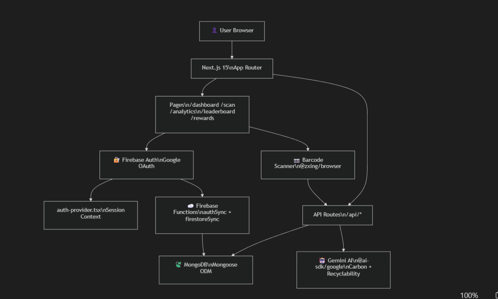

# EcoVerse

## 📺 Application Demo


<p align="center">
  EcoVerse helps users understand the environmental impact of products through barcode scanning, carbon footprint analysis, recyclability insights, eco-points, and community driven sustainability challenges.
</p>

## Table of Contents

- [Overview](#overview)
- [Features](#features)
  - [Barcode Scanning](#barcode-scanning)
  - [Carbon Footprint Analysis](#carbon-footprint-analysis)
  - [Recyclability Insights](#recyclability-insights)
  - [Rewards System](#rewards-system)
  - [Community Features](#community-features)
  - [Analytics Dashboard](#analytics-dashboard)

- [Tech Stack](#tech-stack)
- [Architecture Overview](#architecture-overview)
  - [Application Flow](#application-flow)
  - [Core Components](#core-components)

- [Project Structure](#project-structure)
- [Application Routes](#application-routes)
- [API Endpoints](#api-endpoints)
- [Getting Started](#getting-started)
  - [Prerequisites](#prerequisites)
  - [Clone the Repository](#clone-the-repository)
  - [Install Dependencies](#install-dependencies)
  - [Configure Environment Variables](#configure-environment-variables)
  - [Start Development Server](#start-development-server)

- [Contributors](#contributors)
- [License](#license)

## Overview

EcoVerse is a sustainability-focused web application designed to encourage environmentally conscious decision-making. Users can scan product barcodes to receive sustainability insights, track their carbon impact, earn rewards for eco-friendly actions, and compete on community leaderboards.

Built with modern web technologies and AI powered analysis, EcoVerse combines education, gamification, and data-driven sustainability tracking into a single platform.

---

## Features

### Barcode Scanning

- Real-time barcode scanning
- Product identification
- Instant sustainability insights

### Carbon Footprint Analysis

- Carbon emission estimation
- Product impact comparison
- Sustainability tracking history

### Recyclability Insights

- Packaging analysis
- Recycling recommendations
- Eco-friendly disposal guidance

### Rewards System

- Eco-points for sustainable actions
- Achievement badges
- Monthly reward milestones

### Community Features

- Leaderboards
- User rankings
- Sustainability challenges

### Analytics Dashboard

- Carbon impact trends
- Scan history
- Sustainability statistics
- Progress visualization

---

## Tech Stack

| Layer            | Technology                   |
| ---------------- | ---------------------------- |
| Framework        | Next.js 15 (App Router)      |
| Language         | TypeScript 5                 |
| Styling          | Tailwind CSS                 |
| UI Components    | Radix UI + shadcn/ui         |
| Authentication   | Firebase Auth                |
| Database         | MongoDB + Mongoose           |
| AI Integration   | Gemini AI                    |
| Barcode Scanning | @zxing/browser, html5-qrcode |
| Charts           | Recharts                     |
| Forms            | React Hook Form + Zod        |
| Notifications    | Sonner                       |
| Cloud Functions  | Firebase Functions           |

---

## Architecture Overview

### Application Flow

<p align="center">
  
</p>

### Core Components

#### 🔐 Authentication (Firebase Authentication)

Firebase Authentication powers secure user access and identity management throughout EcoVerse.

- **Google OAuth:** Allows users to sign in instantly using their existing Google accounts, eliminating the need to create new passwords.
- **Session Management:** Keeps users securely logged into the platform across sessions while automatically handling authentication state.
- **User Identity:** Creates and maintains unique user profiles that connect scan history, rewards, achievements, and sustainability data to individual accounts.

#### 🌱 Sustainability Engine (AI-Powered Services)

The Sustainability Engine analyzes products and generates environmental insights to help users make informed sustainability decisions.

- **Carbon Footprint Estimation:** Calculates the estimated environmental impact and carbon emissions associated with scanned products.
- **Packaging Analysis:** Evaluates packaging materials and characteristics to determine sustainability impact.
- **Recyclability Inference:** Provides recycling recommendations and eco-friendly disposal guidance based on packaging information.

#### 🏆 Rewards Engine (Gamification & Tracking)

The Rewards Engine encourages sustainable behavior through points, achievements, and community-driven engagement.

- **Eco-points:** Awards points whenever users complete eco-friendly actions or scan products.
- **Achievement Badges:** Unlocks milestone-based badges that recognize user progress and sustainability efforts.
- **Monthly Rewards:** Tracks monthly milestones and distributes rewards for consistent participation.
- **Leaderboard Rankings:** Displays real-time community rankings that encourage healthy competition and long-term engagement.

---

## Project Structure

```text
EcoVerse/
│
├── 📁 .github/                            # GitHub automation
│   ├── 📁 ISSUE_TEMPLATE/
│   │   ├── bug_report.md                  # Bug report issue template
│   │   └── feature_request.md             # Feature request issue template
│   └── PULL_REQUEST_TEMPLATE.md           # PR checklist template
│
├── 📁 app/                                # Next.js App Router (pages + API)
│   ├── layout.tsx                         # Root layout — wraps all pages with providers
│   ├── page.tsx                           # Home / landing page route
│   ├── globals.css                        # Global Tailwind base styles
│   │
│   ├── 📁 auth/                           # Auth routes
│   │   ├── 📁 signin/
│   │   │   └── page.tsx                   # Sign-in page (Google OAuth)
│   │   └── 📁 signup/
│   │       └── page.tsx                   # Sign-up page
│   │
│   ├── 📁 dashboard/
│   │   └── page.tsx                       # User dashboard (stats, history, points)
│   │
│   ├── 📁 scan/
│   │   ├── page.tsx                       # Live barcode scanner page
│   │   └── loading.tsx                    # Loading skeleton for scan page
│   │
│   ├── 📁 carbon-tracking/
│   │   └── page.tsx                       # Carbon footprint history & tracking
│   │
│   ├── 📁 analytics/
│   │   └── page.tsx                       # Charts & sustainability trends
│   │
│   ├── 📁 leaderboard/
│   │   └── page.tsx                       # Community leaderboard rankings
│   │
│   ├── 📁 rewards/
│   │   └── page.tsx                       # Eco-points, badges & monthly rewards
│   │
│   └── 📁 api/                            # Next.js API Routes (server-side handlers)
│       ├── 📁 auth/
│       │   ├── 📁 google/                 # Google OAuth callback
│       │   ├── 📁 signin/                 # Sign-in endpoint
│       │   └── 📁 signup/                 # Sign-up endpoint
│       │
│       ├── 📁 scan/
│       │   └── route.ts                   # POST: barcode → AI carbon + recyclability
│       │
│       ├── 📁 user/
│       │   ├── 📁 score/
│       │   │   └── route.ts               # GET/POST: user eco-score management
│       │   └── (route.ts)                 # GET/POST: user CRUD
│       │
│       ├── 📁 user-packaging/
│       │   └── route.ts                   # User packaging preferences
│       │
│       ├── 📁 leaderboard/
│       │   └── route.ts                   # GET: ranked users by eco-points
│       │
│       ├── 📁 rewards/
│       │   ├── route.ts                   # GET/POST: reward milestones & claims
│       │   └── 📁 monthly-check/          # Monthly reward reset logic
│       │
│       ├── 📁 test-db/                    # GET: MongoDB connection health check
│       ├── 📁 debug/                      # Debug info endpoint
│       └── 📁 debug-create-user/          # Debug: manual user creation
│
├── 📁 components/                         # Shared React components
│   ├── auth-provider.tsx                  # Firebase Auth context, session, user state
│   ├── landing-page.tsx                   # Full landing page UI (~18KB)
│   ├── dashboard-layout.tsx               # Sidebar + top nav shell layout
│   ├── barcode-scanner.tsx                # Camera + ZXing real-time barcode scanning
│   ├── google-signin-button.tsx           # Firebase Google OAuth trigger button
│   ├── avatar-selection-page.tsx          # Profile avatar picker UI
│   ├── packaging-info.tsx                 # Recyclability information display
│   ├── reward-notification.tsx            # Single reward toast/banner
│   ├── rewards-notification.tsx           # Extended rewards notification variant
│   ├── theme-provider.tsx                 # next-themes context wrapper
│   ├── theme-toggle.tsx                   # Dark/light mode toggle button
│   ├── simple-theme-toggle.tsx            # Minimal toggle variant
│   │
│   └── 📁 ui/                             # ~50 base UI components (shadcn/ui)
│       ├── accordion.tsx                  # Collapsible accordion sections
│       ├── alert.tsx / alert-dialog.tsx   # Alert banners and modal dialogs
│       ├── avatar.tsx                     # User avatar with fallback
│       ├── badge.tsx                      # Status/label badges
│       ├── button.tsx                     # Primary button component
│       ├── calendar.tsx                   # Date picker calendar
│       ├── card.tsx                       # Content card container
│       ├── carousel.tsx                   # Swipeable carousel
│       ├── chart.tsx                      # Recharts wrapper component (~10KB)
│       ├── checkbox.tsx / radio-group.tsx # Form controls
│       ├── command.tsx                    # Command palette (cmdk)
│       ├── dialog.tsx / drawer.tsx        # Modal dialog + bottom sheet
│       ├── dropdown-menu.tsx              # Dropdown context menus
│       ├── form.tsx                       # React Hook Form integration
│       ├── input.tsx / textarea.tsx       # Text input fields
│       ├── label.tsx                      # Form field labels
│       ├── menubar.tsx                    # Top navigation menubar
│       ├── navigation-menu.tsx            # Nav menu component
│       ├── pagination.tsx                 # Page navigation
│       ├── popover.tsx                    # Floating popover
│       ├── progress.tsx                   # Progress bar
│       ├── resizable.tsx                  # Resizable panel layouts
│       ├── scroll-area.tsx                # Custom scrollable area
│       ├── select.tsx                     # Dropdown select input
│       ├── separator.tsx                  # Visual divider
│       ├── sheet.tsx                      # Slide-out side panel
│       ├── sidebar.tsx                    # Full sidebar component (~23KB)
│       ├── skeleton.tsx                   # Loading skeleton placeholder
│       ├── slider.tsx                     # Range slider input
│       ├── sonner.tsx                     # Toast notification wrapper
│       ├── switch.tsx                     # Toggle switch input
│       ├── table.tsx                      # Data table component
│       ├── tabs.tsx                       # Tabbed content panels
│       ├── toast.tsx / toaster.tsx        # Toast notification system
│       ├── toggle.tsx / toggle-group.tsx  # Toggle buttons
│       └── tooltip.tsx                    # Hover tooltip
│
├── 📁 lib/                                # Core business logic & utilities
│   ├── firebase.ts                        # Firebase SDK init + app config
│   ├── mongodb.ts                         # Mongoose connection singleton (cached)
│   ├── carbon-calculator.ts               # CO₂ emission estimates per product
│   ├── packaging-inference.ts             # Recyclability inference logic
│   ├── rewards-system.ts                  # Points engine, thresholds, badges (~14KB)
│   └── utils.ts                           # clsx + tailwind-merge helper fn
│
├── 📁 models/                             # Mongoose ODM schemas
│   └── User.ts                            # User schema (UID, points, scans, avatar…)
│
├── 📁 hooks/                              # Custom React hooks
│   ├── use-toast.ts                       # Toast state hook
│   └── use-mobile.tsx                     # Mobile breakpoint detection hook
│
├── 📁 styles/
│   └── globals.css                        # Additional global styles
│
├── 📁 public/                             # Static assets (served at root)
│   ├── demo.gif                           # Application demo gif
│   ├── logo.png                           # App logo
│   ├── barcode-data.json                  # Static barcode reference data
│   ├── 📁 avatars/                        # User avatar image assets
│   └── (placeholder images, SVGs…)
│
├── 📁 firebase-functions-sync-ts/         # 🔥 Firebase Cloud Functions (PRIMARY)
│   ├── firebase.json                      # Firebase project config
│   ├── .firebaserc                        # Firebase project alias
│   └── 📁 functions/
│       ├── package.json
│       ├── tsconfig.json
│       └── 📁 src/
│           ├── index.ts                   # Function entry point + exports
│           ├── authSync.ts                # Syncs Firebase Auth users → MongoDB
│           ├── firestoreSync.ts           # Syncs Firestore changes → MongoDB
│           └── 📁 utils/                  # Shared function utilities
│
├── 📁 firebase-functions-sync-prisma/     # Firebase Functions (Prisma ORM experiment)
├── 📁 firebase-functions-sync-ts-backup/  # Backup snapshot of functions
├── 📁 linkFBtoMDB/                        # Standalone Firebase ↔ MongoDB sync util
│
├── next.config.mjs                        # Next.js configuration
├── next.config.ts                         # Next.js config (TS variant)
├── tailwind.config.ts                     # Tailwind theme + custom tokens
├── tsconfig.json                          # TypeScript compiler options
├── components.json                        # shadcn/ui CLI config
├── postcss.config.mjs                     # PostCSS config (for Tailwind)
├── package.json                           # Dependencies & npm scripts
│
├── README.md                              # Project overview & setup guide
├── CONTRIBUTING.md                        # Contributor guide (GitHub standard)
├── Contribution.md                        # Enhanced contributor guide (GSSoC)
├── CODE_OF_CONDUCT.md                     # Community code of conduct
├── LICENSE.txt                            # MIT license
├── REWARDS_SYSTEM.md                      # Eco-points & rewards documentation
├── MONGODB_SETUP.md                       # MongoDB setup guide
└── MONGODB_TROUBLESHOOTING.md             # MongoDB troubleshooting guide
```

For a detailed breakdown of the entire project structure, API routes, database schema, cloud functions, and system architecture, see **ARCHITECTURE.md**.

---

## Application Routes

| Route              | Description              |
| ------------------ | ------------------------ |
| `/`                | Landing Page             |
| `/dashboard`       | User Dashboard           |
| `/scan`            | Barcode Scanner          |
| `/carbon-tracking` | Carbon Tracking          |
| `/analytics`       | Sustainability Analytics |
| `/leaderboard`     | Community Rankings       |
| `/rewards`         | Rewards and Badges       |

---

## API Endpoints

| Endpoint                     | Description                     |
| ---------------------------- | ------------------------------- |
| `/api/auth/google`           | Google Authentication           |
| `/api/auth/signin`           | User Sign In                    |
| `/api/auth/signup`           | User Sign Up                    |
| `/api/scan`                  | Product Sustainability Analysis |
| `/api/user/avatar`           | User Avatar Management          |
| `/api/user/score`            | Eco Score Management            |
| `/api/user-packaging`        | Packaging Preferences           |
| `/api/leaderboard`           | Community Rankings              |
| `/api/rewards`               | Rewards Management              |
| `/api/rewards/monthly-check` | Monthly Reward Validation       |
| `/api/debug-create-user`     | Create Test User                |
| `/api/debug/points`          | Debug Points Operations         |
| `/api/test-db`               | Database Connection Test        |

---

## Getting Started

### Prerequisites

> **Note:** EcoVerse requires Node.js 20 or later. Consider adding an `engines` field in `package.json` or a `.nvmrc` file to enforce the version across development environments.

- Node.js 20+
- npm or pnpm
- MongoDB Database
- Firebase Project

### Clone the Repository

```bash
git clone https://github.com/Shiv24angi/EcoVerse.git

cd EcoVerse
```

### Install Dependencies

```bash
npm install
```

### Configure Environment Variables

Create a `.env.local` file.

You can obtain

- Firebase credentials from the [Firebase Console](https://console.firebase.google.com/)
- MongoDB URI from your [MongoDB Atlas](https://www.mongodb.com/cloud/atlas) cluster
- [Gemini API](https://aistudio.google.com/app/api-keys)

````env
# Firebase
NEXT_PUBLIC_FIREBASE_API_KEY=
NEXT_PUBLIC_FIREBASE_AUTH_DOMAIN=
NEXT_PUBLIC_FIREBASE_PROJECT_ID=
NEXT_PUBLIC_FIREBASE_STORAGE_BUCKET=
NEXT_PUBLIC_FIREBASE_MESSAGING_SENDER_ID=
NEXT_PUBLIC_FIREBASE_APP_ID=
NEXT_PUBLIC_FIREBASE_MEASUREMENT_ID=

# MongoDB
MONGODB_URI=

# Authentication
JWT_SECRET=

# Gemini AI
GEMINI_API_KEY=

### Start Development Server

```bash
npm run dev
````

Visit:

```text
http://localhost:3000
```

### Docker Deployment

To spin up the application in an isolated container without configuring local Node versions or databases:

1. **Initialize Environment Variables:**
   Copy the template file to set up your local environment.

   ```text
   cp .env.example .env
   ```

   Note: Open the newly created .env file and populate it with your actual Firebase and Gemini credentials. The Docker Compose setup includes a local MongoDB container that automatically initializes with the Mongo credentials you provide in .env. You do not need to manually provision a MongoDB Atlas cluster for local development.

2. Build and Start the Container:

   ```Bash
   docker compose up -d --build
   ```

3. Access the Application:
   Open your browser and navigate to:

   ```Plaintext
   http://localhost:3000
   ```

---

## Contributors

Thanks to everyone who contributes to EcoVerse.

<a href="https://github.com/Shiv24angi/EcoVerse/graphs/contributors">
  
</a>

---

## License

This project is licensed under the MIT License. See the LICENSE file for more information.
